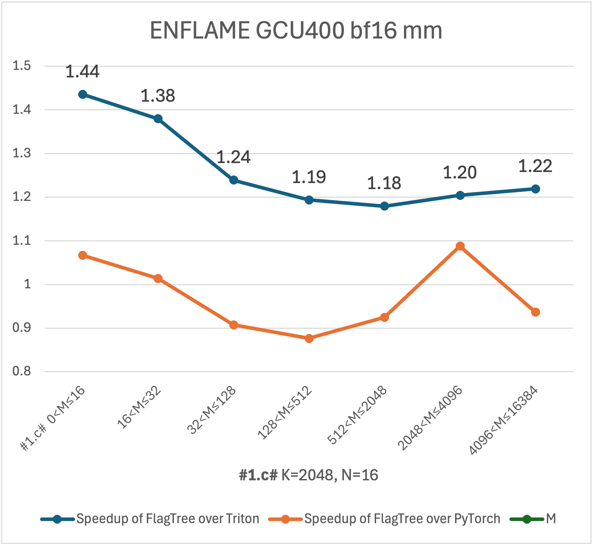
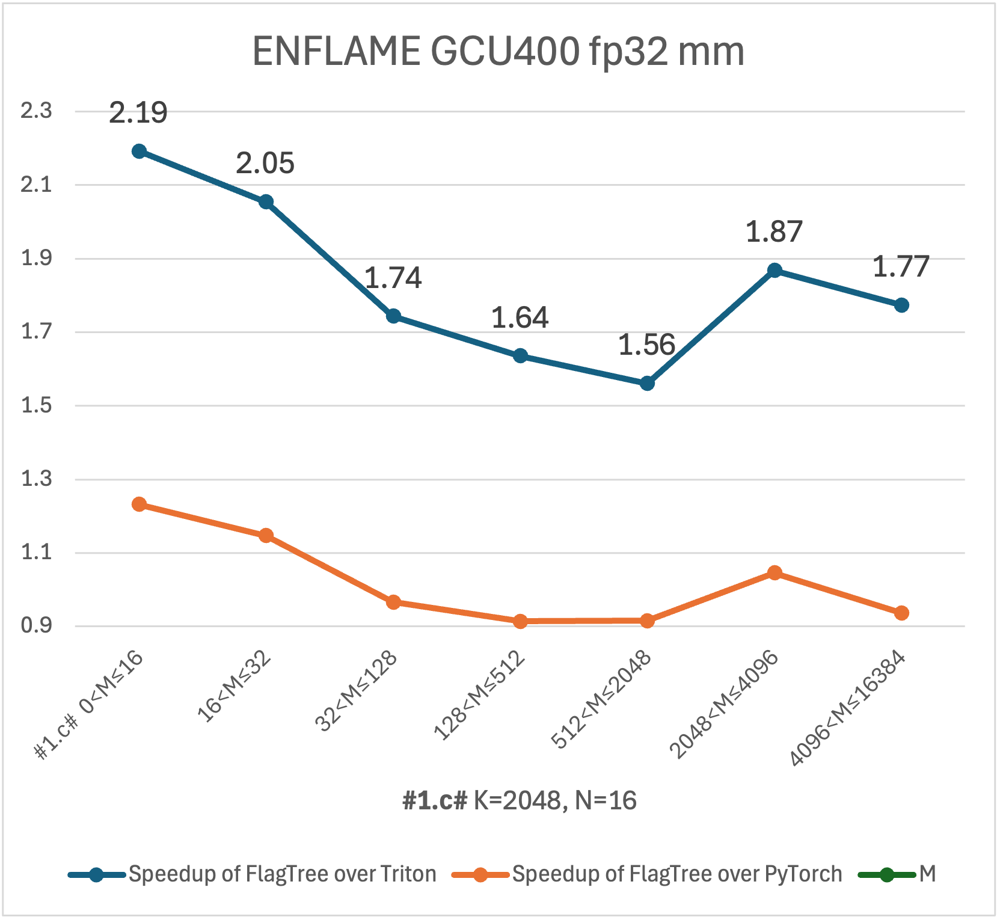

[](https://flagos.io/)
[[中文版](./README_cn.md)|English]

<div align="right">
  <a href="https://www.linkedin.com/company/flagos-community" target="_blank">
    
  </a>

  <a href="https://www.youtube.com/@FlagOS_Official" target="_blank">
    
  </a>

  <a href="https://x.com/FlagOS_Official" target="_blank">
    
  </a>

  <a href="https://www.facebook.com/flagosglobalcommunity" target="_blank">
    
  </a>

  <a href="https://discord.com/invite/ubqGuFMTNE" target="_blank">
    
  </a>
</div>


FlagTree is part of [FlagOS](https://flagos.io/), a fully open-source system software stack designed to unify the model–system–chip layers and foster an open and collaborative ecosystem.
It enables a "develop once, run anywhere" workflow across diverse AI accelerators,
unlocking hardware performance, eliminating fragmentation among AI chipset-specific software stacks,
and substantially lowering the cost of porting and maintaining AI workloads.

FlagTree is an open source, unified compiler for multiple AI chips project dedicated to developing a diverse ecosystem of AI chip compilers and related tooling platforms,
thereby fostering and strengthening the upstream and downstream Triton ecosystem.
Currently in its initial phase, the project aims to maintain compatibility with existing adaptation solutions while unifying the codebase to rapidly implement single-repository multi-backend support.
For upstream model users, it provides unified compilation capabilities across multiple backends;
for downstream chip manufacturers, it offers examples of Triton ecosystem integration.

## Multi-backend support

Each backend is based on different versions of Triton, and therefore resides in different protected branches.
All these protected branches have equal status. CI/CD runners are provisioned for every backend listed in the table.

|Branch|Vendor|Backend|Triton<br>version|Installation|
|:-----|:-----|:------|:----------------|:-----------|
|[triton_v3.6.x](https://github.com/flagos-ai/flagtree/tree/triton_v3.6.x)|NVIDIA<br>AMD<br>Enflame（燧原）<br>HYGON（海光信息）<br>Moore Threads（摩尔线程）<br>DAMO ACADEMY（阿里达摩院）<br>Huixi（辉羲智能）|[nvidia](https://github.com/flagos-ai/FlagTree/tree/triton_v3.6.x/third_party/nvidia/)<br>[amd](https://github.com/flagos-ai/FlagTree/tree/triton_v3.6.x/third_party/amd/)<br>[enflame](https://github.com/flagos-ai/FlagTree/tree/triton_v3.6.x/third_party/enflame/)<br>[hcu](https://github.com/flagos-ai/FlagTree/tree/triton_v3.6.x/third_party/hcu/)<br>[mthreads](https://github.com/flagos-ai/FlagTree/tree/triton_v3.6.x/third_party/mthreads/)<br>[damoacademy](https://github.com/flagos-ai/FlagTree/tree/triton_v3.6.x/third_party/thrive/)<br>[rpu](https://github.com/flagos-ai/FlagTree/tree/triton_v3.6.x/third_party/rpu/)|3.6|[install nvidia](/documents/install.md)<br>[install amd](/documents/install.md)<br>[install enflame](/documents/install_enflame.md)<br>[install hcu](/documents/install_hcu.md)<br>[install mthreads](/documents/install_mthreads.md)<br>-<br>[install rpu](/documents/install_rpu.md)|
|[triton_v3.5.x](https://github.com/flagos-ai/flagtree/tree/triton_v3.5.x)|NVIDIA<br>AMD<br>Enflame（燧原）<br>Huawei Ascend（华为昇腾）|[nvidia](https://github.com/flagos-ai/FlagTree/tree/triton_v3.5.x/third_party/nvidia/)<br>[amd](https://github.com/flagos-ai/FlagTree/tree/triton_v3.5.x/third_party/amd/)<br>[enflame](https://github.com/flagos-ai/FlagTree/tree/triton_v3.5.x/third_party/enflame/)<br>[ascend](https://github.com/flagos-ai/FlagTree/blob/triton_v3.5.x/third_party/ascend/)|3.5|[install nvidia](/documents/install.md)<br>[install amd](/documents/install.md)<br>[install enflame](/documents/install_enflame.md)<br>[install ascend](/documents/install_ascend.md)|
|[triton_v3.4.x](https://github.com/flagos-ai/flagtree/tree/triton_v3.4.x)|NVIDIA<br>AMD<br>Sunrise（曦望芯科）|[nvidia](https://github.com/flagos-ai/FlagTree/tree/triton_v3.4.x/third_party/nvidia/)<br>[amd](https://github.com/flagos-ai/FlagTree/tree/triton_v3.4.x/third_party/amd/)<br>[sunrise](https://github.com/flagos-ai/FlagTree/tree/triton_v3.4.x/third_party/sunrise/)|3.4|[install nvidia](/documents/install.md)<br>[install amd](/documents/install.md)<br>[install sunrise](/documents/install_sunrise.md)|
|[triton_v3.3.x](https://github.com/flagos-ai/flagtree/tree/triton_v3.3.x)|NVIDIA<br>AMD<br>x86_64 cpu<br>ARM China（安谋科技）<br>Tsingmicro（清微智能）<br>Enflame（燧原）<br>ARM64 cpu|[nvidia](https://github.com/flagos-ai/FlagTree/tree/triton_v3.3.x/third_party/nvidia/)<br>[amd](https://github.com/flagos-ai/FlagTree/tree/triton_v3.3.x/third_party/amd/)<br>[triton-shared](https://github.com/microsoft/triton-shared)<br>[aipu](https://github.com/flagos-ai/FlagTree/tree/triton_v3.3.x/third_party/aipu/)<br>[tsingmicro](https://github.com/flagos-ai/FlagTree/tree/triton_v3.3.x/third_party/tsingmicro/)<br>[enflame](https://github.com/flagos-ai/FlagTree/tree/triton_v3.3.x/third_party/enflame/)<br>[cpu](https://github.com/flagos-ai/FlagTree/tree/triton_v3.3.x/third_party/cpu/)|3.3|[install nvidia](/documents/install.md)<br>[install amd](/documents/install.md)<br>-<br>[install aipu](/documents/install_aipu.md)<br>[install tsingmicro](/documents/install_tsingmicro.md)<br>[install enflame](/documents/install_enflame.md)<br>[install cpu](/documents/install_cpu.md)|
|[triton_v3.2.x](https://github.com/flagos-ai/flagtree/tree/triton_v3.2.x)|NVIDIA<br>AMD<br>Huawei Ascend（华为昇腾）<br>Moore Threads（摩尔线程）<br>Cambricon（寒武纪）|[nvidia](https://github.com/flagos-ai/FlagTree/tree/triton_v3.2.x/third_party/nvidia/)<br>[amd](https://github.com/flagos-ai/FlagTree/tree/triton_v3.2.x/third_party/amd/)<br>[ascend](https://github.com/flagos-ai/FlagTree/blob/triton_v3.2.x/third_party/ascend/)<br>[mthreads](https://github.com/flagos-ai/FlagTree/tree/triton_v3.2.x/third_party/mthreads/)<br>[cambricon](https://github.com/flagos-ai/FlagTree/tree/triton_v3.2.x/third_party/cambricon/)|3.2|[install nvidia](/documents/install.md)<br>[install amd](/documents/install.md)<br>[install ascend](/documents/install_ascend.md)<br>[install mthreads](/documents/install_mthreads.md)<br>-|
|[main](https://github.com/flagos-ai/flagtree/tree/main)|NVIDIA<br>AMD<br>x86_64 cpu<br>ILUVATAR（天数智芯）<br>Moore Threads（摩尔线程）<br>KLX<br>MetaX（沐曦股份）<br>HYGON（海光信息）|[nvidia](/third_party/nvidia/)<br>[amd](/third_party/amd/)<br>[triton-shared](https://github.com/microsoft/triton-shared)<br>[iluvatar](/third_party/iluvatar/)<br>[mthreads](/third_party/mthreads/)<br>[xpu](/third_party/xpu/)<br>[metax](/third_party/metax/)<br>[hcu](third_party/hcu/)|3.1<br>3.1<br>3.1<br>3.1<br>3.1<br>3.0<br>3.0<br>3.1|[install nvidia](/documents/install.md)<br>[install amd](/documents/install.md)<br>-<br>[install iluvatar](/documents/install_iluvatar.md)<br>[install mthreads](/documents/install_mthreads.md)<br>[install xpu](/documents/install_xpu.md)<br>[install metax](/documents/install_metax.md)<br>[install hcu](/documents/install_hcu.md)|

FlagTree extension components are currently available on some backends:

|Branch|Backend|Triton version|Extension components|
|:-----|:------|:-------------|:-------------------|
|[triton_v3.6.x](https://github.com/flagos-ai/flagtree/tree/triton_v3.6.x)|[nvidia](https://github.com/flagos-ai/FlagTree/tree/triton_v3.6.x/third_party/nvidia/)<br>[enflame](https://github.com/flagos-ai/FlagTree/tree/triton_v3.6.x/third_party/enflame/)|3.6|[TLE-Lite](https://github.com/flagos-ai/FlagTree/wiki/TLE#32-tle-lite)<br>[TLE-Struct GPU](https://github.com/flagos-ai/FlagTree/wiki/TLE#331-gpu)<br>[TLE-Raw](https://github.com/flagos-ai/FlagTree/wiki/TLE-Raw)<br>[HINTS](https://github.com/flagos-ai/FlagTree/wiki/HINTS)|
|[triton_v3.6.x](https://github.com/flagos-ai/flagtree/tree/triton_v3.6.x)|[mthreads](https://github.com/flagos-ai/FlagTree/tree/triton_v3.6.x/third_party/mthreads/)|3.6|[TLE-Lite](https://github.com/flagos-ai/FlagTree/wiki/TLE#32-tle-lite)<br>[TLE-Struct GPU](https://github.com/flagos-ai/FlagTree/wiki/TLE#331-gpu)|
|[triton_v3.3.x](https://github.com/flagos-ai/flagtree/tree/triton_v3.3.x)|[tsingmicro](https://github.com/flagos-ai/FlagTree/blob/triton_v3.3.x/third_party/tsingmicro/)|3.3|[TLE-Lite](https://github.com/flagos-ai/FlagTree/wiki/TLE#32-tle-lite)<br>[TLE-Struct DSA](https://github.com/flagos-ai/FlagTree/wiki/TLE#332-dsa)<br>[FLIR](https://github.com/flagos-ai/flir)|
|[triton_v3.3.x](https://github.com/flagos-ai/flagtree/tree/triton_v3.3.x)|[aipu](https://github.com/flagos-ai/FlagTree/blob/triton_v3.3.x/third_party/aipu/)|3.3|[FLIR](https://github.com/flagos-ai/flir)<br>[HINTS](https://github.com/flagos-ai/FlagTree/wiki/HINTS)|
|[triton_v3.2.x](https://github.com/flagos-ai/flagtree/tree/triton_v3.2.x)|[ascend](https://github.com/flagos-ai/FlagTree/blob/triton_v3.2.x/third_party/ascend/)|3.2|[TLE-Struct DSA](https://github.com/flagos-ai/FlagTree/wiki/TLE#332-dsa)<br>[FLIR](https://github.com/flagos-ai/flir)<br>[HINTS](https://github.com/flagos-ai/FlagTree/wiki/HINTS)|

## TLE (Triton Language Extensions)

Triton provides strong productivity for kernel development, but heterogeneous AI chips and deeper performance tuning scenarios need more explicit control over distributed execution, memory access patterns, and hardware-specific primitives. TLE extends Triton in a layered way to bridge this gap while keeping compatibility with existing Triton workflows.

Key advantages of TLE:

* Progressive abstraction from portable usage to hardware-oriented tuning (`Lite` / `Struct` / `Raw`).
* Better coverage for multi-device, architecture-specific, and backend lowering scenarios.
* Lower migration cost from existing Triton kernels while preserving optimization headroom.

For detailed design, APIs, and examples, please refer to the [TLE Wiki](https://github.com/flagos-ai/FlagTree/wiki/TLE) and [TLE-Raw Wiki](https://github.com/flagos-ai/FlagTree/wiki/TLE-Raw).

## Performance Improvements

Without modifying any Triton operator code, FlagTree can achieve performance gains for certain shapes in real-world models.
The following uses the mm operator under some shapes called in the Qwen model as an example to demonstrate FlagTree's performance speedup ratio on various chips.

  
  
  
  
  
  

## Latest News

* 2026/06/10 Added the [rpu](https://github.com/flagos-ai/FlagTree/tree/triton_v3.6.x/third_party/rpu/) backend integration (based on Triton 3.6) and added CI/CD.
* 2026/06/08 Upgraded the [ascend](https://github.com/flagos-ai/FlagTree/tree/triton_v3.5.x/third_party/ascend/) backend to Triton 3.5 and added CI/CD.
* 2026/06/03 Added the ARM64 [cpu](https://github.com/flagos-ai/FlagTree/tree/triton_v3.3.x/third_party/cpu/) backend integration (based on Triton 3.3).
* 2026/06/01 Added the [damoacademy](https://github.com/flagos-ai/FlagTree/tree/triton_v3.6.x/third_party/thrive/) backend integration (based on Triton 3.6) and added CI/CD.
* 2026/05/12 Upgraded the [mthreads](https://github.com/flagos-ai/FlagTree/tree/triton_v3.6.x/third_party/mthreads/) backend to Triton 3.6 and added CI/CD.
* 2026/05/07 Upgraded the [hcu](https://github.com/flagos-ai/FlagTree/tree/triton_v3.6.x/third_party/hcu/) backend to Triton 3.6 and added CI/CD.
* 2026/04/24 Upgraded the [mthreads](https://github.com/flagos-ai/FlagTree/tree/triton_v3.2.x/third_party/mthreads/) backend to Triton 3.2 and added CI/CD.
* 2026/04/17 Upgraded the [enflame](https://github.com/flagos-ai/FlagTree/tree/triton_v3.6.x/third_party/enflame/) backend to Triton 3.6 and added CI/CD.
* 2026/03/13 Upgraded the [enflame](https://github.com/flagos-ai/FlagTree/tree/triton_v3.5.x/third_party/enflame/) backend to Triton 3.5 and added CI/CD.
* 2026/01/23 Added the [sunrise](https://github.com/flagos-ai/FlagTree/tree/triton_v3.4.x/third_party/sunrise/) backend integration (based on Triton 3.4) and added CI/CD.
* 2026/01/08 Added wiki pages for new features [HINTS](https://github.com/flagos-ai/FlagTree/wiki/HINTS), [TLE](https://github.com/flagos-ai/FlagTree/wiki/TLE), [TLE-Raw](https://github.com/flagos-ai/FlagTree/wiki/TLE-Raw).
* 2025/12/08 Added the [enflame](https://github.com/flagos-ai/FlagTree/tree/triton_v3.3.x/third_party/enflame/) backend integration (based on Triton 3.3) and added CI/CD.
* 2025/11/26 Added FlagTree_Backend_Specialization Unified Design Document [FlagTree_Backend_Specialization](/documents/decoupling/).
* 2025/10/28 Added support for the offline build with pre-downloaded dependency packages, improving the build experience in restricted environments. See the usage instructions below.
* 2025/09/30 Added support for shared memory flagtree_hints on GPGPU.
* 2025/09/29 Migrated the SDK storage to ksyuncs, improving download stability.
* 2025/09/25 Added support for flagtree_hints in the ascend backend compilation.
* 2025/09/16 Added the [hcu](https://github.com/flagos-ai/FlagTree/tree/main/third_party/hcu/) backend integration (based on Triton 3.0) and added CI/CD.
* 2025/09/09 Forked and modified [llvm-project](https://github.com/FlagTree/llvm-project) to support [FLIR](https://github.com/flagos-ai/flir).
* 2025/09/01 Added support for Paddle framework and added CI/CD.
* 2025/08/16 Added support for Beijing Super Cloud Computing Center.
* 2025/08/04 Added the T*** backend integration (based on Triton 3.1).
* 2025/08/01 [FLIR](https://github.com/flagos-ai/flir) supports flagtree_hints for shared memory loading.
* 2025/07/30 Upgraded the [cambricon](https://github.com/flagos-ai/FlagTree/tree/triton_v3.2.x/third_party/cambricon/) backend to Triton 3.2.
* 2025/07/25 The Inspur team added support for OpenAnolis OS.
* 2025/07/09 [FLIR](https://github.com/flagos-ai/flir) added support for Async DMA flagtree_hints.
* 2025/07/08 Added UnifiedHardware manager for multi-backend compilation.
* 2025/07/02 Added the S*** backend integration (based on Triton 3.3).
* 2025/06/20 [FLIR](https://github.com/flagos-ai/flir) added support for MLIR extension functionality.
* 2025/06/06 Added the [tsingmicro](https://github.com/flagos-ai/FlagTree/tree/triton_v3.3.x/third_party/tsingmicro/) backend integration (based on Triton 3.3) and added CI/CD.
* 2025/06/04 Added the [ascend](https://github.com/flagos-ai/FlagTree/blob/triton_v3.2.x/third_party/ascend) backend integration (based on Triton 3.2) and added CI/CD.
* 2025/06/03 Added the [metax](https://github.com/flagos-ai/FlagTree/tree/main/third_party/metax/) backend integration (based on Triton 3.0) and added CI/CD.
* 2025/05/21 [FLIR](https://github.com/flagos-ai/flir) added support for conversion functionality to middle layer.
* 2025/04/09 Added the [aipu](https://github.com/flagos-ai/FlagTree/tree/triton_v3.3.x/third_party/aipu/) backend integration (based on Triton 3.3), provided a torch standard extension [example](https://github.com/flagos-ai/flagtree/blob/triton_v3.3.x/third_party/aipu/backend/aipu_torch_dev.cpp) and added CI/CD.
* 2025/03/26 Integrated security compliance scanning.
* 2025/03/19 Added the [xpu](https://github.com/flagos-ai/FlagTree/tree/main/third_party/xpu/) backend integration (based on Triton 3.0) and added CI/CD.
* 2025/03/19 Added the [mthreads](https://github.com/flagos-ai/FlagTree/tree/main/third_party/mthreads/) backend integration (based on Triton 3.1) and added CI/CD.
* 2025/03/12 Added the [iluvatar](https://github.com/flagos-ai/FlagTree/tree/main/third_party/iluvatar/) backend integration (based on Triton 3.1) and added CI/CD.

# Environment setup

The best practice to avoid environment compatibility issues is to use the image recommended in [Multi-backend support](#multi-backend-support) table.

## Install from source

Installation dependencies (Confirm the correct python3.x version is being used):

```shell
apt update; apt install zlib1g zlib1g-dev libxml2 libxml2-dev nlohmann-json3-dev
python3 -m pip install -r python/requirements.txt
```

General building and installation procedure (Recommended for environments with good network connectivity):

```shell
# Set FLAGTREE_BACKEND using the backend name from the table above
export FLAGTREE_BACKEND=${backend_name}  # Do not set it on nvidia/amd/triton-shared

# For Triton 3.1/3.2/3.3 (branch: main, triton_v3.2.x, triton_v3.3.x)
cd python
python3 -m pip install . --no-build-isolation -v  # Install flagtree and uninstall triton

# For Triton 3.4/3.5/3.6 (branch: triton_v3.4.x, triton_v3.5.x, triton_v3.6.x)
python3 -m pip install . --no-build-isolation -v  # Install flagtree and uninstall triton
```

After installing `flagtree`, you can check it with:

```shell
python3 -m pip show flagtree
cd ${ANY_DIR_OTHER_THAN_FLAGTREE_PYTHON}; python3 -c 'import triton; print(triton.__path__)'
```

## Source-free Installation

If you do not wish to build from source, you can directly pull and install whl (partial backend support).

```shell
# Note: First install PyTorch, then execute the following commands
python3 -m pip uninstall -y triton  # Repeat the cmd until fully uninstalled
RES="--index-url=https://resource.flagos.net/repository/flagos-pypi-hosted/simple"
```

|Backend   |Install command<br>(The version corresponds to the git tag)|Triton<br>ver.|libc.so &<br>libstdc++.so|
|:---------|:---------|:---------|:---------|
|nvidia    |python3.12 -m pip install flagtree===0.6.0rc2 $RES              |3.6|GLIBC_2.39<br>GLIBCXX_3.4.33<br>CXXABI_1.3.15|
|nvidia    |python3.12 -m pip install flagtree===0.5.0+3.5 $RES             |3.5|GLIBC_2.39<br>GLIBCXX_3.4.33<br>CXXABI_1.3.15|
|nvidia    |python3.12 -m pip install flagtree===0.4.0+3.3 $RES             |3.3|GLIBC_2.30<br>GLIBCXX_3.4.28<br>CXXABI_1.3.12|
|nvidia    |python3.12 -m pip install flagtree===0.5.0+3.1 $RES             |3.1|GLIBC_2.39<br>GLIBCXX_3.4.33<br>CXXABI_1.3.15|
|iluvatar  |python3.12 -m pip install flagtree===0.5.1+iluvatar3.1 $RES     |3.1|GLIBC_2.39<br>GLIBCXX_3.4.33<br>CXXABI_1.3.15|
|iluvatar  |python3.10 -m pip install flagtree===0.5.1+iluvatar3.1 $RES     |3.1|GLIBC_2.35<br>GLIBCXX_3.4.30<br>CXXABI_1.3.13|
|mthreads  |python3.10 -m pip install flagtree===0.6.0rc2+mthreads3.6 $RES  |3.6|GLIBC_2.35<br>GLIBCXX_3.4.30<br>CXXABI_1.3.13|
|mthreads  |python3.10 -m pip install flagtree===0.5.1+mthreads3.2 $RES     |3.2|GLIBC_2.35<br>GLIBCXX_3.4.30<br>CXXABI_1.3.13|
|mthreads  |python3.10 -m pip install flagtree===0.5.1+mthreads3.1 $RES     |3.1|GLIBC_2.35<br>GLIBCXX_3.4.30<br>CXXABI_1.3.13|
|xpu       |python3.10 -m pip install flagtree===0.5.1+xpu3.0 $RES          |3.0|GLIBC_2.31<br>GLIBCXX_3.4.28<br>CXXABI_1.3.12|
|metax     |python3.12 -m pip install flagtree===0.5.1+metax3.0 $RES        |3.0|GLIBC_2.35<br>GLIBCXX_3.4.30<br>CXXABI_1.3.13|
|hcu       |python3.10 -m pip install flagtree===0.6.0rc1+hcu3.6 $RES       |3.6|GLIBC_2.35<br>GLIBCXX_3.4.30<br>CXXABI_1.3.13|
|hcu       |python3.10 -m pip install flagtree===0.5.1+hcu3.1 $RES          |3.1|GLIBC_2.35<br>GLIBCXX_3.4.30<br>CXXABI_1.3.13|
|ascend    |python3.11 -m pip install flagtree===0.6.0rc1+ascend3.5 $RES    |3.5|GLIBC_2.35<br>GLIBCXX_3.4.30<br>CXXABI_1.3.13|
|ascend    |python3.11 -m pip install flagtree===0.6.0rc1+ascend3.2 $RES    |3.2|GLIBC_2.35<br>GLIBCXX_3.4.30<br>CXXABI_1.3.13|
|tsingmicro|python3.10 -m pip install flagtree===0.6.0rc1+tsingmicro3.3 $RES|3.3|GLIBC_2.30<br>GLIBCXX_3.4.28<br>CXXABI_1.3.12|
|aipu      |python3.10 -m pip install flagtree===0.5.0+aipu3.3 $RES         |3.3|GLIBC_2.35<br>GLIBCXX_3.4.30<br>CXXABI_1.3.13|
|sunrise   |python3.10 -m pip install flagtree===0.4.0+sunrise3.4 $RES      |3.4|GLIBC_2.39<br>GLIBCXX_3.4.33<br>CXXABI_1.3.15|
|enflame   |python3.12 -m pip install flagtree===0.6.0rc1+enflame3.6 $RES   |3.6|GLIBC_2.39<br>GLIBCXX_3.4.33<br>CXXABI_1.3.15|
|enflame   |python3.12 -m pip install flagtree===0.5.0+enflame3.5 $RES      |3.5|GLIBC_2.39<br>GLIBCXX_3.4.33<br>CXXABI_1.3.15|
|enflame   |python3.10 -m pip install flagtree===0.4.0+enflame3.3 $RES      |3.3|GLIBC_2.35<br>GLIBCXX_3.4.30<br>CXXABI_1.3.13|

Historical versions of flagtree can be found at https://resource.flagos.net/#browse/search/pypi/=assets.attributes.pypi.description%3Dflagtree

## Contributing

Contributions to FlagTree development are welcome. Please refer to [CONTRIBUTING.md](/CONTRIBUTING_cn.md) for details.

## License

FlagTree is licensed under the [MIT license](/LICENSE).
