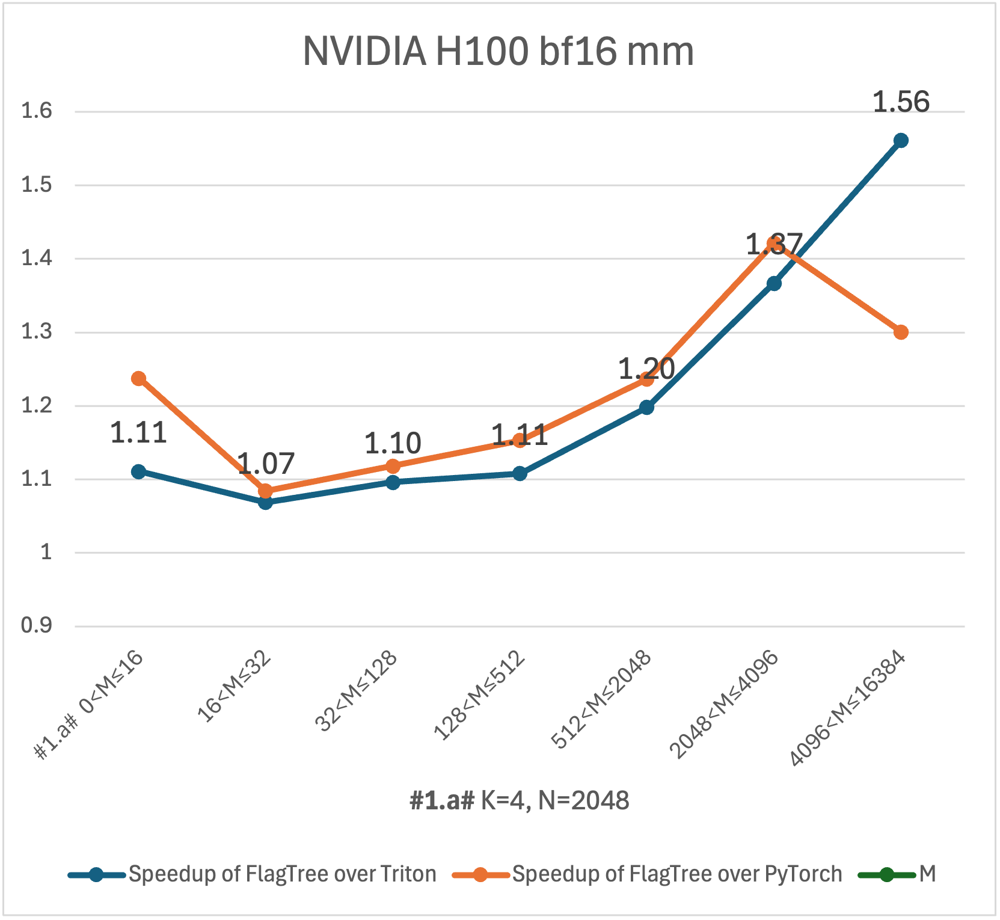
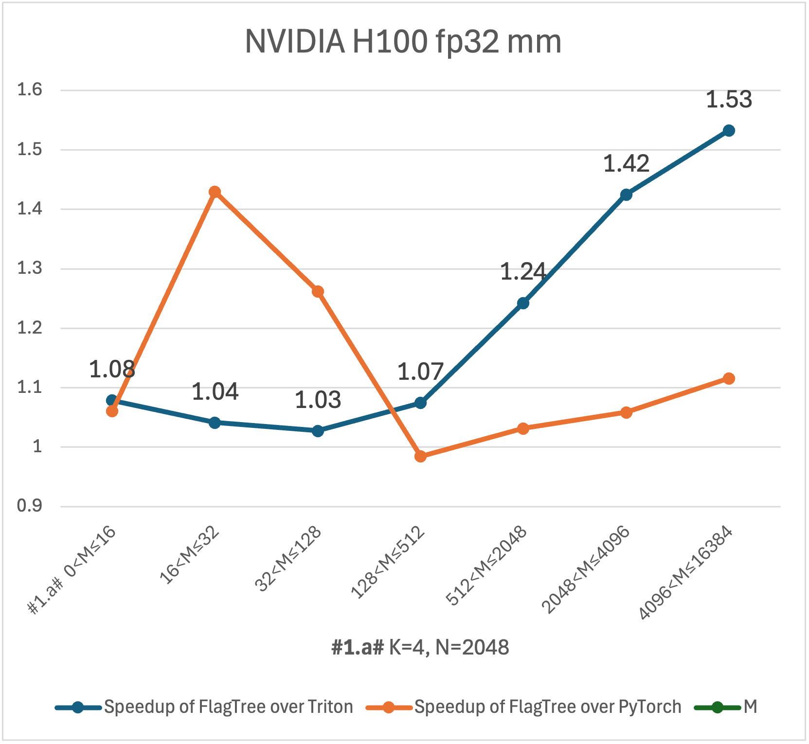
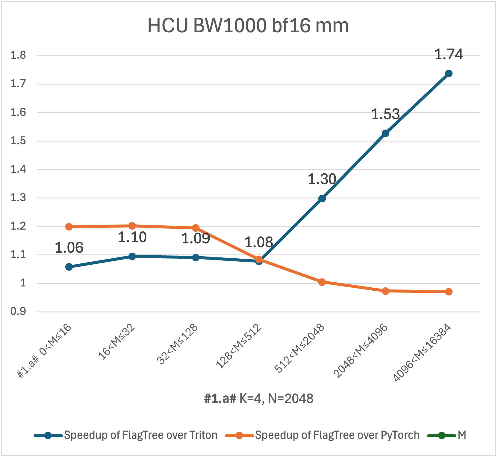
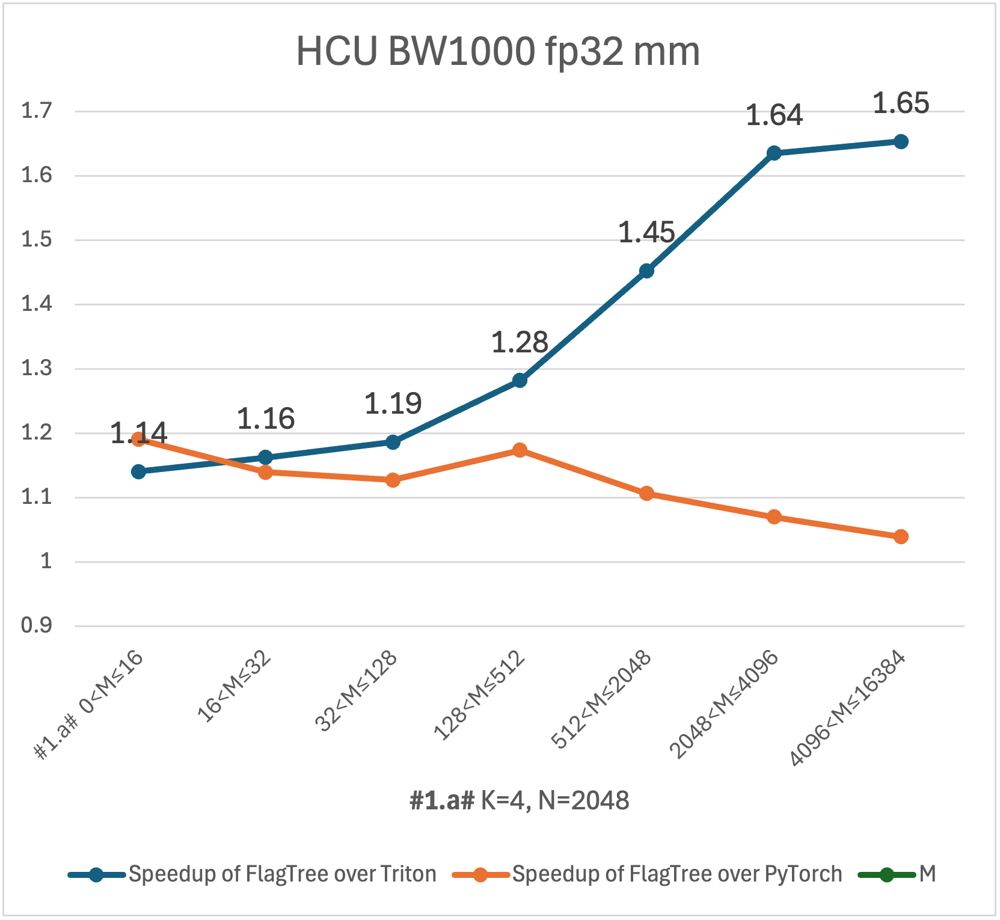
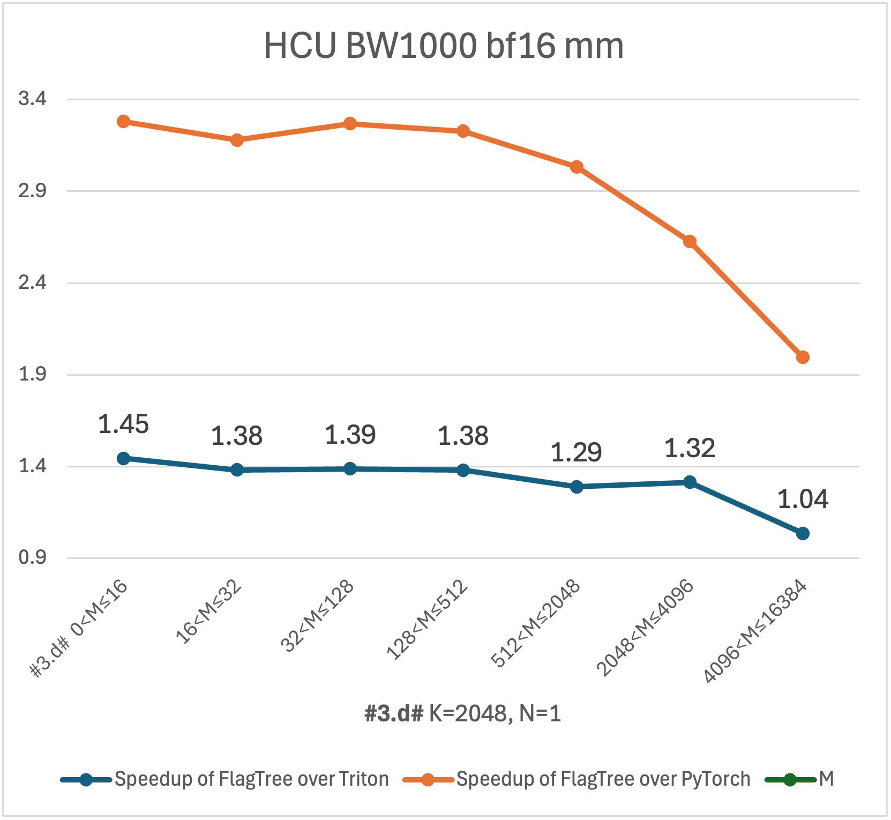
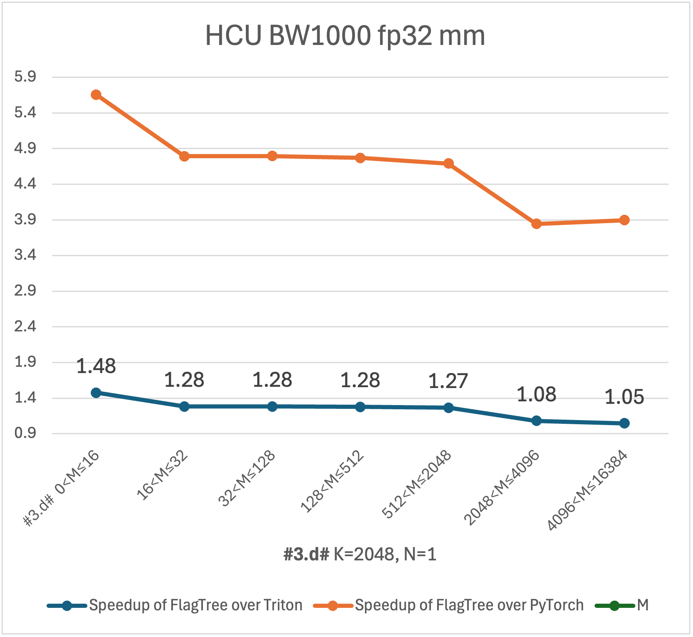
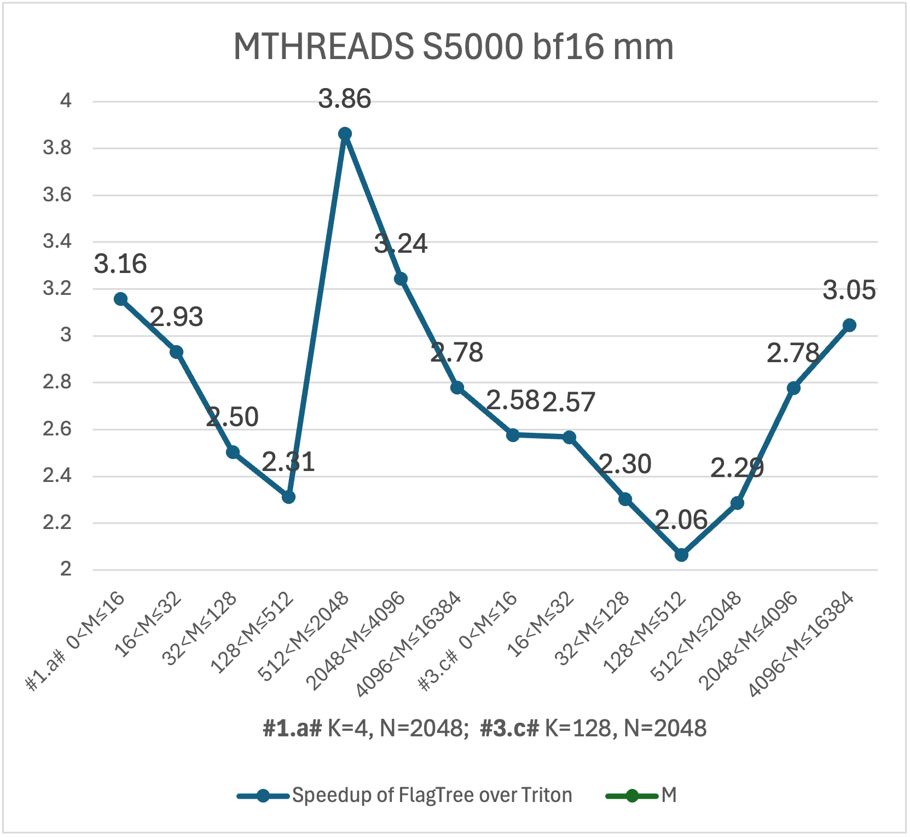
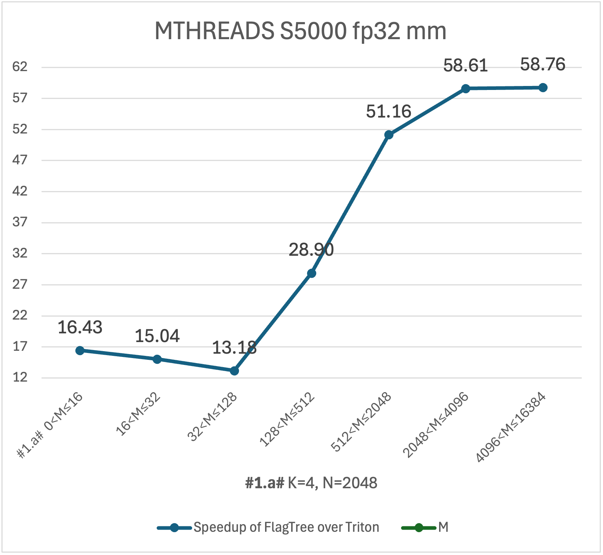
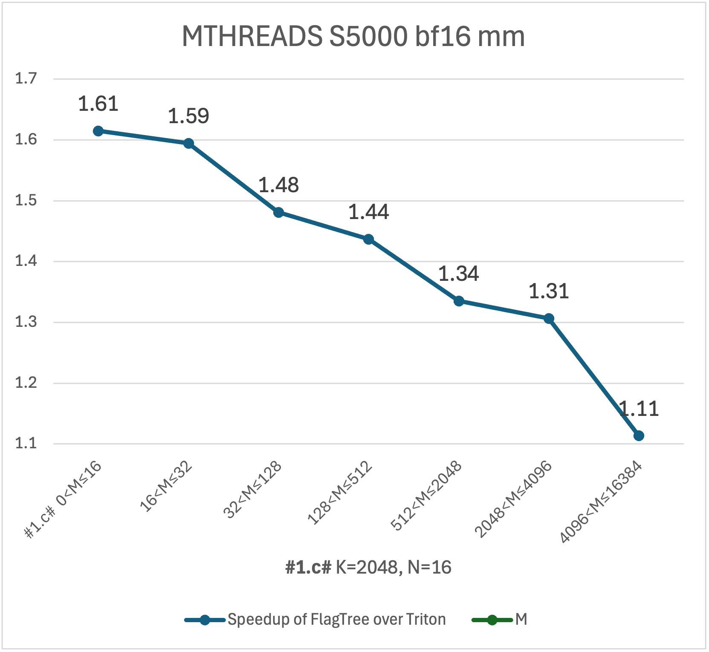
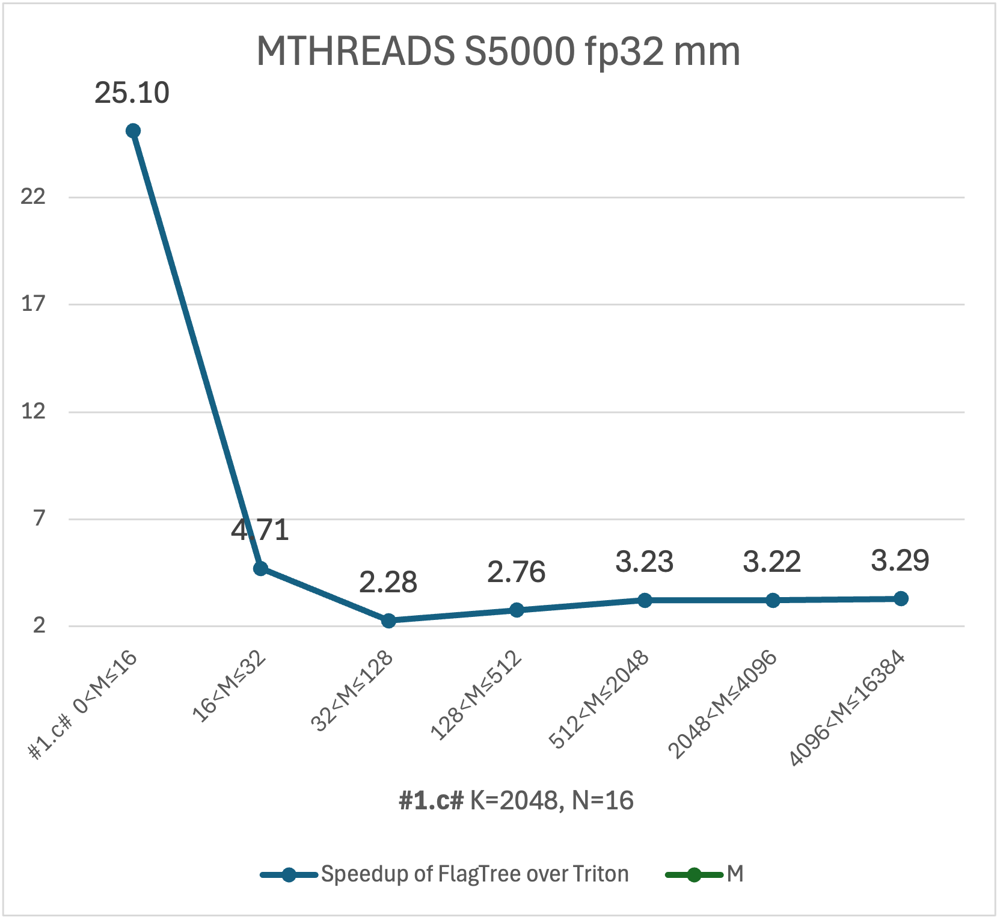

[](https://flagos.io/)
[中文版|[English](./README.md)]

<div align="right">
  <a href="https://www.linkedin.com/company/flagos-community" target="_blank">
    
  </a>

  <a href="https://www.youtube.com/@FlagOS_Official" target="_blank">
    
  </a>

  <a href="https://x.com/FlagOS_Official" target="_blank">
    
  </a>

  <a href="https://www.facebook.com/flagosglobalcommunity" target="_blank">
    
  </a>

  <a href="https://discord.com/invite/ubqGuFMTNE" target="_blank">
    
  </a>
</div>

FlagTree 是 [FlagOS](https://flagos.io/) 的一部分。
FlagOS 是一个面向多元AI芯片的开源、统一系统软件栈，旨在打通模型、系统与芯片层，培育开放协作的生态系统。
它支持 “一次开发，多芯运行” 的工作流，兼容多样化的 AI 加速芯片。
它释放硬件性能潜力，消除各类 AI 芯片专用软件栈之间的碎片化问题，并大幅降低大模型在多种 AI 硬件移植与维护的成本。

FlagTree 是面向多种 AI 芯片的开源、统一编译器。
FlagTree 致力于打造多元 AI 芯片编译器及相关工具平台，发展和壮大 Triton 上下游生态。
项目当前处于初期，目标是兼容现有适配方案，统一代码仓库，快速实现单仓库多后端支持。
对于上游模型用户，提供多后端的统一编译能力；
对于下游芯片厂商，提供 Triton 生态接入范例。

## 多后端支持

各后端基于不同版本的 Triton 适配，因此位于不同的主干分支。
各主干分支均为保护分支且地位相等，表格中所有后端均搭建了 CI/CD Runner。

|主干分支|厂商|后端|Triton 版本|安装|
|:------|:--|:--|:---------|:---|
|[main](https://github.com/flagos-ai/flagtree/tree/main)|NVIDIA<br>AMD<br>x86_64 cpu<br>ILUVATAR（天数智芯）<br>Moore Threads（摩尔线程）<br>KLX<br>MetaX（沐曦股份）<br>HYGON（海光信息）|[nvidia](/third_party/nvidia/)<br>[amd](/third_party/amd/)<br>[triton-shared](https://github.com/microsoft/triton-shared)<br>[iluvatar](/third_party/iluvatar/)<br>[mthreads](/third_party/mthreads/)<br>[xpu](/third_party/xpu/)<br>[metax](/third_party/metax/)<br>[hcu](third_party/hcu/)|3.1<br>3.1<br>3.1<br>3.1<br>3.1<br>3.0<br>3.0<br>3.1|[install nvidia](/documents/install.md)<br>[install amd](/documents/install.md)<br>-<br>[install iluvatar](/documents/install_iluvatar.md)<br>[install mthreads](/documents/install_mthreads.md)<br>[install xpu](/documents/install_xpu.md)<br>[install metax](/documents/install_metax.md)<br>[install hcu](/documents/install_hcu.md)|
|[triton_v3.2.x](https://github.com/flagos-ai/flagtree/tree/triton_v3.2.x)|NVIDIA<br>AMD<br>Huawei Ascend（华为昇腾）<br>Moore Threads（摩尔线程）<br>Cambricon（寒武纪）|[nvidia](https://github.com/flagos-ai/FlagTree/tree/triton_v3.2.x/third_party/nvidia/)<br>[amd](https://github.com/flagos-ai/FlagTree/tree/triton_v3.2.x/third_party/amd/)<br>[ascend](https://github.com/flagos-ai/FlagTree/blob/triton_v3.2.x/third_party/ascend/)<br>[mthreads](https://github.com/flagos-ai/FlagTree/tree/triton_v3.2.x/third_party/mthreads/)<br>[cambricon](https://github.com/flagos-ai/FlagTree/tree/triton_v3.2.x/third_party/cambricon/)|3.2|[install nvidia](/documents/install.md)<br>[install amd](/documents/install.md)<br>[install ascend](/documents/install_ascend.md)<br>[install mthreads](/documents/install_mthreads.md)<br>-|
|[triton_v3.3.x](https://github.com/flagos-ai/flagtree/tree/triton_v3.3.x)|NVIDIA<br>AMD<br>x86_64 cpu<br>ARM China（安谋科技）<br>Tsingmicro（清微智能）<br>Enflame（燧原）|[nvidia](https://github.com/flagos-ai/FlagTree/tree/triton_v3.3.x/third_party/nvidia/)<br>[amd](https://github.com/flagos-ai/FlagTree/tree/triton_v3.3.x/third_party/amd/)<br>[triton-shared](https://github.com/microsoft/triton-shared)<br>[aipu](https://github.com/flagos-ai/FlagTree/tree/triton_v3.3.x/third_party/aipu/)<br>[tsingmicro](https://github.com/flagos-ai/FlagTree/tree/triton_v3.3.x/third_party/tsingmicro/)<br>[enflame](https://github.com/flagos-ai/FlagTree/tree/triton_v3.3.x/third_party/enflame/)|3.3|[install nvidia](/documents/install.md)<br>[install amd](/documents/install.md)<br>-<br>[install aipu](/documents/install_aipu.md)<br>[install tsingmicro](/documents/install_tsingmicro.md)<br>[install enflame](/documents/install_enflame.md)|
|[triton_v3.4.x](https://github.com/flagos-ai/flagtree/tree/triton_v3.4.x)|NVIDIA<br>AMD<br>Sunrise（曦望芯科）|[nvidia](https://github.com/flagos-ai/FlagTree/tree/triton_v3.4.x/third_party/nvidia/)<br>[amd](https://github.com/flagos-ai/FlagTree/tree/triton_v3.4.x/third_party/amd/)<br>[sunrise](https://github.com/flagos-ai/FlagTree/tree/triton_v3.4.x/third_party/sunrise/)|3.4|[install nvidia](/documents/install.md)<br>[install amd](/documents/install.md)<br>[install sunrise](/documents/install_sunrise.md)|
|[triton_v3.5.x](https://github.com/flagos-ai/flagtree/tree/triton_v3.5.x)|NVIDIA<br>AMD<br>Enflame（燧原）|[nvidia](https://github.com/flagos-ai/FlagTree/tree/triton_v3.5.x/third_party/nvidia/)<br>[amd](https://github.com/flagos-ai/FlagTree/tree/triton_v3.5.x/third_party/amd/)<br>[enflame](https://github.com/flagos-ai/FlagTree/tree/triton_v3.5.x/third_party/enflame/)|3.5|[install nvidia](/documents/install.md)<br>[install amd](/documents/install.md)<br>[install enflame](/documents/install_enflame.md)|
|[triton_v3.6.x](https://github.com/flagos-ai/flagtree/tree/triton_v3.6.x)|NVIDIA<br>AMD<br>Enflame（燧原）<br>HYGON（海光信息）<br>Moore Threads（摩尔线程）|[nvidia](https://github.com/flagos-ai/FlagTree/tree/triton_v3.6.x/third_party/nvidia/)<br>[amd](https://github.com/flagos-ai/FlagTree/tree/triton_v3.6.x/third_party/amd/)<br>[enflame](https://github.com/flagos-ai/FlagTree/tree/triton_v3.6.x/third_party/enflame/)<br>[hcu](https://github.com/flagos-ai/FlagTree/tree/triton_v3.6.x/third_party/hcu/)<br>[mthreads](https://github.com/flagos-ai/FlagTree/tree/triton_v3.6.x/third_party/mthreads/)|3.6|[install nvidia](/documents/install.md)<br>[install amd](/documents/install.md)<br>[install enflame](/documents/install_enflame.md)<br>[install hcu](/documents/install_hcu.md)<br>[install mthreads](/documents/install_mthreads.md)|

FlagTree 的扩展组件当前在部分后端可用：

|主干分支|后端|Triton 版本|扩展组件|
|:------|:--|:---------|:------|
|[triton_v3.6.x](https://github.com/flagos-ai/flagtree/tree/triton_v3.6.x)|[nvidia](https://github.com/flagos-ai/FlagTree/tree/triton_v3.6.x/third_party/nvidia/)<br>[enflame](https://github.com/flagos-ai/FlagTree/tree/triton_v3.6.x/third_party/enflame/)|3.6|[TLE-Lite](https://github.com/flagos-ai/FlagTree/wiki/TLE#32-tle-lite)<br>[TLE-Struct GPU](https://github.com/flagos-ai/FlagTree/wiki/TLE#331-gpu)<br>[TLE-Raw](https://github.com/flagos-ai/FlagTree/wiki/TLE-Raw)<br>[HINTS](https://github.com/flagos-ai/FlagTree/wiki/HINTS)|
|[triton_v3.2.x](https://github.com/flagos-ai/flagtree/tree/triton_v3.2.x)|[ascend](https://github.com/flagos-ai/FlagTree/blob/triton_v3.2.x/third_party/ascend/)|3.2|[TLE-Struct DSA](https://github.com/flagos-ai/FlagTree/wiki/TLE#332-dsa)<br>[FLIR](https://github.com/flagos-ai/flir)<br>[HINTS](https://github.com/flagos-ai/FlagTree/wiki/HINTS)|
|[triton_v3.3.x](https://github.com/flagos-ai/flagtree/tree/triton_v3.3.x)|[tsingmicro](https://github.com/flagos-ai/FlagTree/blob/triton_v3.3.x/third_party/tsingmicro/)|3.3|[TLE-Lite](https://github.com/flagos-ai/FlagTree/wiki/TLE#32-tle-lite)<br>[TLE-Struct DSA](https://github.com/flagos-ai/FlagTree/wiki/TLE#332-dsa)<br>[FLIR](https://github.com/flagos-ai/flir)|
|[triton_v3.3.x](https://github.com/flagos-ai/flagtree/tree/triton_v3.3.x)|[aipu](https://github.com/flagos-ai/FlagTree/blob/triton_v3.3.x/third_party/aipu/)|3.3|[FLIR](https://github.com/flagos-ai/flir)<br>[HINTS](https://github.com/flagos-ai/FlagTree/wiki/HINTS)|

## TLE（Triton Language Extensions）简介

Triton 在算子开发效率方面表现突出，但在多元 AI 芯片适配和更深层性能调优场景下，往往需要对分布式执行、内存访问模式和硬件相关原语提供更显式的控制。TLE 以分层方式扩展 Triton，在保持现有 Triton 工作流兼容性的同时补齐这部分能力。

TLE 的主要优势包括：

* 从可移植到硬件导向调优的渐进式抽象（`Lite` / `Struct` / `Raw`）。
* 更好覆盖多设备、架构特化与后端 lowering 场景。
* 在保留优化空间的同时，降低现有 Triton kernel 的迁移改造成本。

详细设计、API 与示例请参考 [TLE Wiki](https://github.com/flagos-ai/FlagTree/wiki/TLE) 和 [TLE-Raw Wiki](https://github.com/flagos-ai/FlagTree/wiki/TLE-Raw)。

## 性能改进

无需修改任何 Triton 算子代码，FlagTree 可在实际模型中的某些形状上获得性能增益。
下面以 Qwen 模型中调用的一些形状下的 mm 算子为例，展示 FlagTree 在不同芯片上的性能增益。

  
  
  
  
  

## 新特性

* 2026/05/12 [mthreads](https://github.com/flagos-ai/FlagTree/tree/triton_v3.6.x/third_party/mthreads/) 后端升级到 Triton 3.6，加入 CI/CD。
* 2026/05/07 [hcu](https://github.com/flagos-ai/FlagTree/tree/triton_v3.6.x/third_party/hcu/) 后端升级到 Triton 3.6，加入 CI/CD。
* 2026/04/23 [mthreads](https://github.com/flagos-ai/FlagTree/tree/triton_v3.2.x/third_party/mthreads/) 后端升级到 Triton 3.2，加入 CI/CD。
* 2026/04/17 [enflame](https://github.com/flagos-ai/FlagTree/tree/triton_v3.6.x/third_party/enflame/) 后端升级到 Triton 3.6，加入 CI/CD。
* 2026/03/13 [enflame](https://github.com/flagos-ai/FlagTree/tree/triton_v3.5.x/third_party/enflame/) 后端升级到 Triton 3.5，加入 CI/CD。
* 2026/01/23 新增接入 [sunrise](https://github.com/flagos-ai/FlagTree/tree/triton_v3.4.x/third_party/sunrise/) 后端（对应 Triton 3.4），加入 CI/CD。
* 2026/01/08 添加 [HINTS](https://github.com/flagos-ai/FlagTree/wiki/HINTS)、[TLE](https://github.com/flagos-ai/FlagTree/wiki/TLE)、[TLE-Raw](https://github.com/flagos-ai/FlagTree/wiki/TLE-Raw) 等新功能 WIKI。
* 2025/12/08 新增接入 [enflame](https://github.com/flagos-ai/FlagTree/tree/triton_v3.3.x/third_party/enflame/) 后端（对应 Triton 3.3），加入 CI/CD。
* 2025/11/26 添加 FlagTree 后端特化统一设计文档 [FlagTree_Backend_Specialization](/documents/decoupling/)。
* 2025/10/28 提供离线构建支持（预下载依赖包），改善网络环境受限时的构建体验，使用方法见后文。
* 2025/09/30 在 GPGPU 上支持编译指导 shared memory。
* 2025/09/29 SDK 存储迁移至金山云，大幅提升下载稳定性。
* 2025/09/25 支持编译指导 ascend 的后端编译能力。
* 2025/09/16 新增接入 [hcu](https://github.com/flagos-ai/FlagTree/tree/main/third_party/hcu/) 后端（对应 Triton 3.0），加入 CI/CD。
* 2025/09/09 Fork 并修改 [llvm-project](https://github.com/FlagTree/llvm-project)，承接 [FLIR](https://github.com/flagos-ai/flir) 的功能。
* 2025/09/01 新增适配 Paddle 框架，加入 CI/CD。
* 2025/08/16 新增适配北京超级云计算中心 AI 智算云。
* 2025/08/04 新增接入 T*** 后端（对应 Triton 3.1）。
* 2025/08/01 [FLIR](https://github.com/flagos-ai/flir) 支持编译指导 shared memory loading。
* 2025/07/30 更新 [cambricon](https://github.com/flagos-ai/FlagTree/tree/triton_v3.2.x/third_party/cambricon/) 后端（对应 Triton 3.2）。
* 2025/07/25 浪潮团队新增适配 OpenAnolis 龙蜥操作系统。
* 2025/07/09 [FLIR](https://github.com/flagos-ai/flir) 支持编译指导 Async DMA。
* 2025/07/08 新增多后端编译统一管理模块。
* 2025/07/02 新增接入 S*** 后端（对应 Triton 3.3）。
* 2025/06/20 [FLIR](https://github.com/flagos-ai/flir) 开始承接 MLIR 扩展功能。
* 2025/06/06 新增接入 [tsingmicro](https://github.com/flagos-ai/FlagTree/tree/triton_v3.3.x/third_party/tsingmicro/) 后端（对应 Triton 3.3），加入 CI/CD。
* 2025/06/04 新增接入 [ascend](https://github.com/flagos-ai/FlagTree/blob/triton_v3.2.x/third_party/ascend) 后端（对应 Triton 3.2），加入 CI/CD。
* 2025/06/03 新增接入 [metax](https://github.com/flagos-ai/FlagTree/tree/main/third_party/metax/) 后端（对应 Triton 3.1），加入 CI/CD。
* 2025/05/21 [FLIR](https://github.com/flagos-ai/flir) 开始承接到中间层的转换功能。
* 2025/04/09 新增接入 [aipu](https://github.com/flagos-ai/FlagTree/tree/triton_v3.3.x/third_party/aipu/) 后端（对应 Triton 3.3），提供 torch 标准扩展[范例](https://github.com/flagos-ai/flagtree/blob/triton_v3.3.x/third_party/aipu/backend/aipu_torch_dev.cpp)，加入 CI/CD。
* 2025/03/26 接入安全合规扫描。
* 2025/03/19 新增接入 [xpu](https://github.com/flagos-ai/FlagTree/tree/main/third_party/xpu/) 后端（对应 Triton 3.0），加入 CI/CD。
* 2025/03/19 新增接入 [mthreads](https://github.com/flagos-ai/FlagTree/tree/main/third_party/mthreads/) 后端（对应 Triton 3.1），加入 CI/CD。
* 2025/03/12 新增接入 [iluvatar](https://github.com/flagos-ai/FlagTree/tree/main/third_party/iluvatar/) 后端（对应 Triton 3.1），加入 CI/CD。

## 环境准备

避免环境匹配问题的最佳实践是使用上文 [多后端支持](#多后端支持) 表格中推荐的镜像。

## 从源码安装

安装依赖（注意使用正确的 python3.x 执行）：

```shell
apt update; apt install zlib1g zlib1g-dev libxml2 libxml2-dev nlohmann-json3-dev
python3 -m pip install -r python/requirements.txt
```

通用的构建安装方式（网络畅通环境下推荐使用）：

```shell
# Set FLAGTREE_BACKEND using the backend name from the table above
export FLAGTREE_BACKEND=${backend_name}  # Do not set it on nvidia/amd/triton-shared

# For Triton 3.1/3.2/3.3 (branch: main, triton_v3.2.x, triton_v3.3.x)
cd python
python3 -m pip install . --no-build-isolation -v  # Install flagtree and uninstall triton

# For Triton 3.4/3.5/3.6 (branch: triton_v3.4.x, triton_v3.5.x, triton_v3.6.x)
python3 -m pip install . --no-build-isolation -v  # Install flagtree and uninstall triton
```

安装 `flagtree` 后，可通过下列命令查看：

```shell
python3 -m pip show flagtree
cd ${ANY_DIR_OTHER_THAN_FLAGTREE_PYTHON}; python3 -c 'import triton; print(triton.__path__)'
```

## 免源码安装

如果不希望从源码安装，可以直接拉取安装 whl（支持部分后端）。

```shell
# Note: First install PyTorch, then execute the following commands
python3 -m pip uninstall -y triton  # Repeat the cmd until fully uninstalled
RES="--index-url=https://resource.flagos.net/repository/flagos-pypi-hosted/simple"
```

|后端       |安装命令（版本号对应 git tag）|Triton<br>版本|libc.so & libstdc++.so|
|:---------|:---------|:---------|:---------|
|nvidia    |python3.12 -m pip install flagtree===0.5.1 $RES              |3.6|GLIBC_2.39<br>GLIBCXX_3.4.33<br>CXXABI_1.3.15|
|nvidia    |python3.12 -m pip install flagtree===0.5.0+3.5 $RES          |3.5|GLIBC_2.39<br>GLIBCXX_3.4.33<br>CXXABI_1.3.15|
|nvidia    |python3.12 -m pip install flagtree===0.4.0+3.3 $RES          |3.3|GLIBC_2.30<br>GLIBCXX_3.4.28<br>CXXABI_1.3.12|
|nvidia    |python3.12 -m pip install flagtree===0.5.0+3.1 $RES          |3.1|GLIBC_2.39<br>GLIBCXX_3.4.33<br>CXXABI_1.3.15|
|iluvatar  |python3.12 -m pip install flagtree===0.5.1+iluvatar3.1 $RES  |3.1|GLIBC_2.39<br>GLIBCXX_3.4.33<br>CXXABI_1.3.15|
|iluvatar  |python3.10 -m pip install flagtree===0.5.1+iluvatar3.1 $RES  |3.1|GLIBC_2.35<br>GLIBCXX_3.4.30<br>CXXABI_1.3.13|
|mthreads  |python3.10 -m pip install flagtree===0.5.1+mthreads3.1 $RES  |3.1|GLIBC_2.35<br>GLIBCXX_3.4.30<br>CXXABI_1.3.13|
|mthreads  |python3.10 -m pip install flagtree===0.5.1+mthreads3.2 $RES  |3.2|GLIBC_2.35<br>GLIBCXX_3.4.30<br>CXXABI_1.3.13|
|mthreads  |python3.10 -m pip install flagtree===0.5.2rc1+mthreads3.6 $RES  |3.6|GLIBC_2.35<br>GLIBCXX_3.4.30<br>CXXABI_1.3.13|
|xpu       |python3.10 -m pip install flagtree===0.5.1+xpu3.0 $RES       |3.0|GLIBC_2.31<br>GLIBCXX_3.4.28<br>CXXABI_1.3.12|
|metax     |python3.12 -m pip install flagtree===0.5.1+metax3.0 $RES     |3.0|GLIBC_2.35<br>GLIBCXX_3.4.30<br>CXXABI_1.3.13|
|hcu       |python3.10 -m pip install flagtree===0.5.1+hcu3.1 $RES       |3.1|GLIBC_2.35<br>GLIBCXX_3.4.30<br>CXXABI_1.3.13|
|hcu       |python3.10 -m pip install flagtree===0.5.1+hcu3.6 $RES       |3.6|GLIBC_2.35<br>GLIBCXX_3.4.30<br>CXXABI_1.3.13|
|ascend    |python3.11 -m pip install flagtree===0.5.0+ascend3.2 $RES    |3.2|GLIBC_2.35<br>GLIBCXX_3.4.30<br>CXXABI_1.3.13|
|tsingmicro|python3.10 -m pip install flagtree===0.5.0+tsingmicro3.3 $RES|3.3|GLIBC_2.30<br>GLIBCXX_3.4.28<br>CXXABI_1.3.12|
|aipu      |python3.10 -m pip install flagtree===0.5.0+aipu3.3 $RES      |3.3|GLIBC_2.35<br>GLIBCXX_3.4.30<br>CXXABI_1.3.13|
|sunrise   |python3.10 -m pip install flagtree===0.4.0+sunrise3.4 $RES   |3.4|GLIBC_2.39<br>GLIBCXX_3.4.33<br>CXXABI_1.3.15|
|enflame   |python3.10 -m pip install flagtree===0.4.0+enflame3.3 $RES   |3.3|GLIBC_2.35<br>GLIBCXX_3.4.30<br>CXXABI_1.3.13|
|enflame   |python3.12 -m pip install flagtree===0.5.0+enflame3.5 $RES   |3.5|GLIBC_2.39<br>GLIBCXX_3.4.33<br>CXXABI_1.3.15|
|enflame   |python3.12 -m pip install flagtree===0.5.0+enflame3.6 $RES   |3.6|GLIBC_2.39<br>GLIBCXX_3.4.33<br>CXXABI_1.3.15|

flagtree 历史版本可以在 https://resource.flagos.net/#browse/search/pypi/=assets.attributes.pypi.description%3Dflagtree 查询

## 关于贡献

欢迎参与 FlagTree 的开发并贡献代码，详情请参考 [CONTRIBUTING.md](/CONTRIBUTING_cn.md)。

## 许可证

FlagTree 使用 [MIT license](/LICENSE)。
